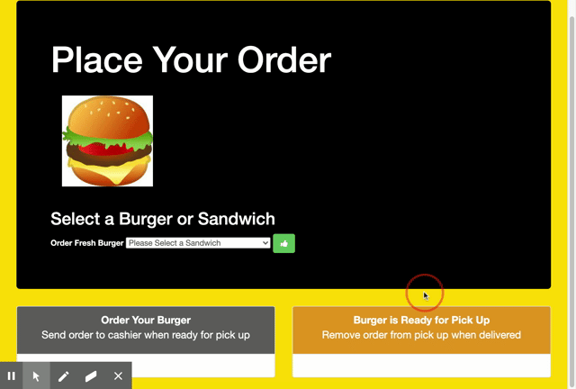

# Burger
Burger is a restaurant app that lets users select the burgers they'd like to eat and then pick them up.

# About
This burger logger will allow you to add your desired burgers to a MySql database and delete said burger at the click of a button.

# Getting Started
1. code: https://github.com/AlexPR704/burger;
2. https://mysterious-temple-94788.herokuapp.com/;

# Instructions
Follow the link above to visit the deployed site.
Add burgers to the database by using the dropdown menu displayed.
Pickup your burgers and you can delete them.

# Built With
MySQL
Node.js
Express.js
Handlebars
MVC design pattern / ORM

# Credits
Big credits will have to go to the TA's and instructors to help me on this task. Also special thanks to a few youtube videos and classmates who helped me out. Big thanks to our activities in class; it really helped out to see how I can make it work.

# License
MIT License

Copyright (c) [2020] [Alexander Garcia]

Permission is hereby granted, free of charge, to any person obtaining a copy of this software and associated documentation files (the "Software"), to deal in the Software without restriction, including without limitation the rights to use, copy, modify, merge, publish, distribute, sublicense, and/or sell copies of the Software, and to permit persons to whom the Software is furnished to do so, subject to the following conditions:

The above copyright notice and this permission notice shall be included in all copies or substantial portions of the Software.

THE SOFTWARE IS PROVIDED "AS IS", WITHOUT WARRANTY OF ANY KIND, EXPRESS OR IMPLIED, INCLUDING BUT NOT LIMITED TO THE WARRANTIES OF MERCHANTABILITY, FITNESS FOR A PARTICULAR PURPOSE AND NONINFRINGEMENT. IN NO EVENT SHALL THE AUTHORS OR COPYRIGHT HOLDERS BE LIABLE FOR ANY CLAIM, DAMAGES OR OTHER LIABILITY, WHETHER IN AN ACTION OF CONTRACT, TORT OR OTHERWISE, ARISING FROM, OUT OF OR IN CONNECTION WITH THE SOFTWARE OR THE USE OR OTHER DEALINGS IN THE SOFTWARE.